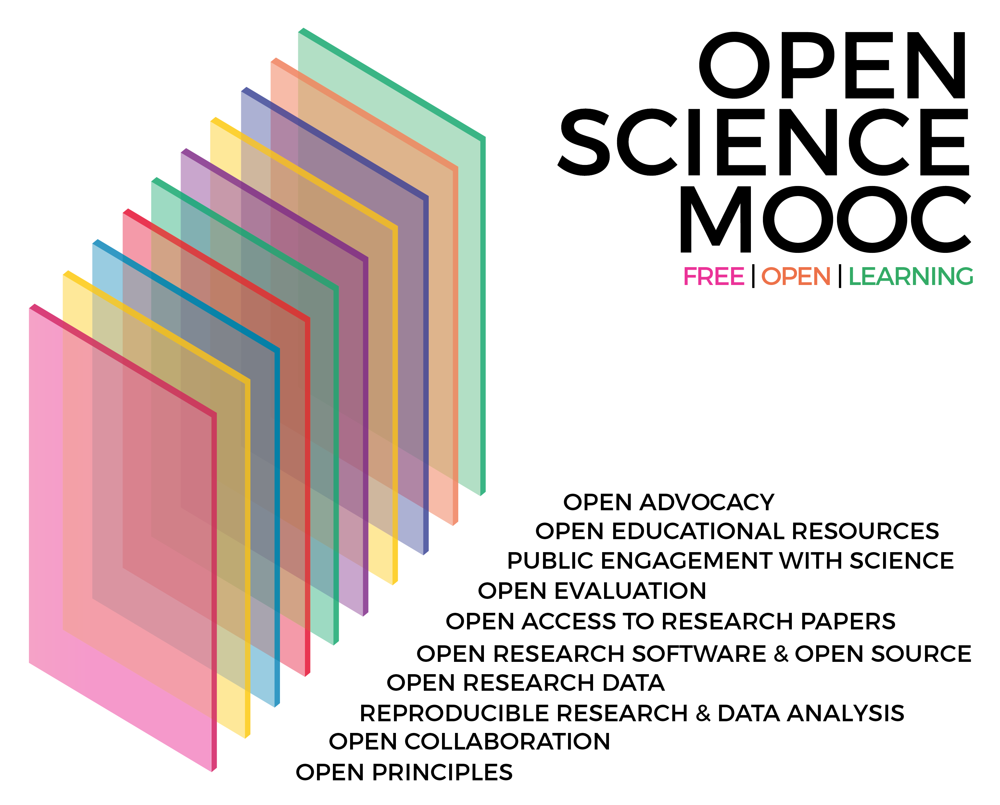

# Main management materials and content

Welcome to the GitHub home of the Open Science MOOC! This repo is aimed to:
1. Provide general information about the MOOC, which can also be found on our main [website](https://opensciencemooc.eu/)
1. Provide the core tools for managing the content development process for the MOOC

## Table of contents
- [Rationale](#Rationale)
- [Contributing](#Contributing)
- [Module design protocol](#Module_design_protocol)
- [Roadmap](#Roadmap)  
- [Code of conduct](#COC)
- [Licenses](#Licenses) 
- [Disclaimer](#Disclaimer)

## Rationale 

Research is getting a global makeover, in part thanks to the power of the internet and the tools it provides for us, and in part due to a growing call for accountability (e.g., reproducibility and data provenance) in research. Global policies are emerging at different levels that include some aspect of 'Open Research', 'Open Scholarship', or 'Open Science', and inclusive of all research disciplines. But our universities are often letting us down, and they are not teaching us the knowledge, tools and skills we need to do research effectively in the 21st century.

Open Science is about increased rigour, accountability, reproducibility for research. It is based on the principles of inclusion, fairness, equity, and sharing. Open Science can be viewed as research simply done properly, and it extends across the Life and Physical Sciences, Engineering, and Mathematics, to Social Science and Humanities.

This MOOC is designed to help equip students and researchers with the skills they need to excel in a modern research environment. It brings together the efforts and resources of hundreds of researchers and practitioners who have all dedicated their time and experience to create a community platform to help propel research forward.

The content of this MOOC is distilled into 10 core modules. Each module will comprise a complete range of resources including videos, research articles, dummy datasets and code, as well as 'homework' tasks to complete as individuals. Because you don't learn how to do Open Science by reading; you learn by doing it.

The MOOC will be hosted through an open source provider. We expect that in the future different systems of certification will be developed, including completion badges. We also intend to build a forum for the open discussion of the MOOC and any relevant topics.

## Contributing 
See [CONTRIBUTING](CONTRIBUTING.md).

## Module design protocol 
See [Module design protocol](MODULE_DESIGN_PROTOCOL.md).

## Roadmap 

## Code of conduct 
See [the code of conduct document](CODE_OF_CONDUCT.md).

## Licenses 

### Content
MOOC content license: 

### Code and software   
Software associated with the MOOCs, or any code snippets contained in the MOOCs, carry the following default license: . If needed a different [OSI approved software license](https://opensource.org/licenses) may be chosen.

## Disclaimer 

We, the contributors, are fully aware that there is no magic "one size fits all solution" when it comes to implementing Open Science philosophies and best practices, especially when covering all research disciplines. However, we also believe that we should not limit ourselves from the onset, just because pragmatic solutions may not exist today for certain disciplines. We aim to set a highly inclusive standard, fully accepting the risk that for some disciplines this strategy may not be fully appropriate. Through that failure, we hope that you, the course users, will join us as course contributors and help us co-create bespoke solutions to your discipline based on principles of transparency, provenance, reproducibility and reuse of knowledge.

